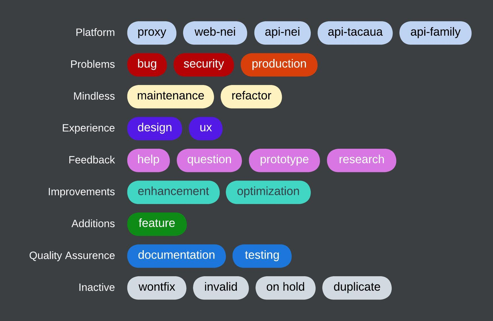

[NEI-AAUAv Platform](../README.md)

# Code of Conduct

This document is a set of guidelines and standards for contributing to the NEI website.

## General

Code and name everything in English. Only use Portuguese for terms that are more easily understood in Portuguese than in English.

## Branching

These are some branching name conventions to keep the consistency and improve team production. For starters, the branch names are all separeted by hyphens.

For more information, check [Git/GitHub branching standards & conventions](https://gist.github.com/digitaljhelms/4287848) from where these practices were based on.

<table>
  <thead>
    <tr>
      <th>Instance</th>
      <th>Branch</th>
      <th>Description</th>
    </tr>
  </thead>
  <tbody>
    <tr>
      <td>Production</td>
      <td><code>deploy</code></td>
      <td>Accepts merges from Working and Hotfixes</td>
    </tr>
    <tr>
      <td>Working</td>
      <td><code>main</code></td>
      <td>Accepts merges from Features/Issues and Hotfixes</td>
    </tr>
    <tr>
      <td>Features/Issues</td>
      <td><code>dev-*</code> <code>&lt;tid>-*</code></td>
      <td>Always branch off HEAD of Working</td>
    </tr>
    <tr>
      <td>Hotfix</td>
      <td><code>hotfix-*</code></td>
      <td>Always branch off Production</td>
    </tr>
  </tbody>
</table>

The main repository will always hold two evergreen branches:

- `main`
- `deploy`

The remaining are supporting branches, which are used to aid parallel development between team members, ease tracking of features, and to assist in quickly fixing live production problems. Each of these branches have a specific purpose and are bound to strict rules as to which branches may be their originating branch and which branches must be their merge targets, as explained on the table above.

The different types of branches we may use are:

- `dev-*` or `<tid>-*` - feature/issue branches
- `hotfix-*` - hotfix branches

The **feature/issue branch** should be used when enhancing or creating a new feature. If its task is meant to resolve an issue, its name should be prefixed with the issue tracker ID `<tid>` instead of the `dev` prefix, for instance:

`12-add-testing-module`

The name shows that the branch applies to the task of adding a testing module, which is associated to the issue with the tracking ID 12. It is recommended to create these branches on the issue itself.

The **hotfix branch** come from the need to act immediately upon an undesired state of a live production version.

## Issue Labeling

The labels were inspired [here](https://robinpowered.com/blog/best-practice-system-for-organizing-and-tagging-github-issues).

