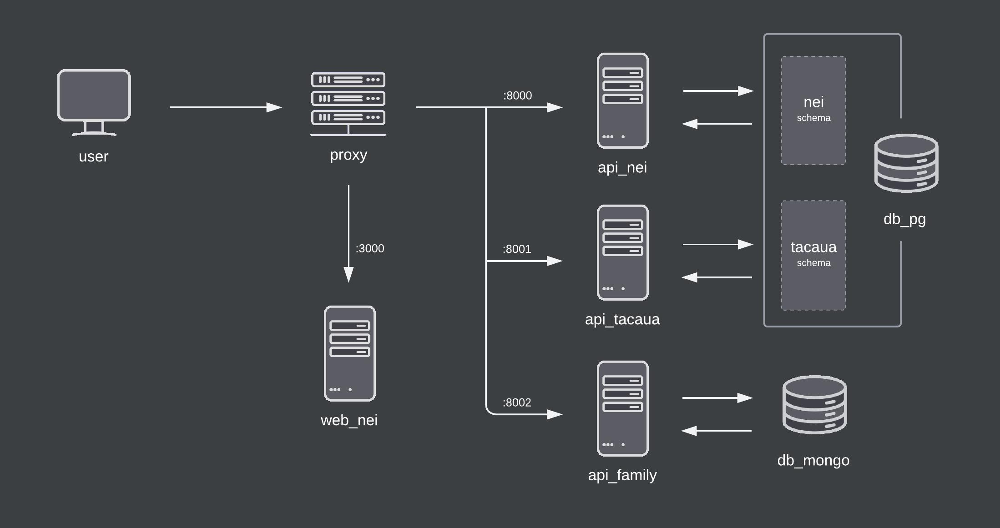

[NEI-AAUAv Platform](../README.md)

# Developer Documentation

## Table of Contents

1. [System Architecture](#1-system-architecture)
2. [Local Installation](#2-local-installation)
3. [Docker Installation](#3-docker-installation)
4. [Docker Deployment](#4-docker-deployment)
5. [Automated Tests](#5-automated-tests)
6. [Installation Troubleshooting](#6-installation-troubleshooting)

## 1. System Architecture

<!-- TODO: complete -->


One of the primary advantages of microservices is that teams can work independently, with their tools and in a different language from other teams. So, code reuse might not be possible.

Schema-per-service – each service has a database schema that’s private to that service

## 2. Local Installation

To run the project in your host machine, read the **Local Installation** section of each service documentation.

- [NEI Web App](../web-nei/README.md#local-installation) web_nei
- [NEI API](../api-nei/README.md#local-installation) api_nei
- [Taça UA API](../api-tacaua/README.md#local-installation) api_tacaua

## 3. Docker Installation

To run the project in docker containers, run the following commands. These will create and run the entire stack, meaning every service, in development mode. Since the containers are using bind mounts, every modification in your code will be triggered on the fly.

Creates and starts all containers of the stack. Use the flag `-d` to run in detached mode.

```
docker-compose up --build
```

Stops or starts all containers of the stack, once already created.

```
docker-compose [stop|start]
```

Stops and removes the containers, including the volumes. Use this to rebuild the stack whenever any dependency is added (e.g. a `yarn` dependency).

```
docker-compose down -v
```

To run one service individually, append the service name to the command (e.g. `api_nei`). On alternative, create the images and the container manually by reading the **Docker Installation** section in the respective service documentation.

- [NEI Web App](../web-nei/README.md#docker-installation) web_nei
- [NEI API](../api-nei/README.md#docker-installation) api_nei
- [Taça UA API](../api-tacaua/README.md#docker-installation) api_tacaua

```
docker-compose up --build [SERVICE...]
```

## 4. Docker Deployment

to be written

<!-- TODO: complete -->

## 5. Automated Tests

to be written

<!-- TODO: complete -->

## 6. Installation Troubleshooting

Common errors that can happen during installation.

### 6.1. Poetry cannot install `psycopg2`

If `psycopg2` cannot be installed with `poetry install` due to the error `pg_config executable not found`, the pyscopg2 documentation recommends installing the following packages:

```
sudo apt install python3-dev libpq-dev
```

### 6.2. Address already in use

If the FastAPI is having problems to start because the address is already in use, it is likely that another application is using the same port it is trying to use (the default port is **8000**). For a quick fix, kill the processes using that port with:

```
sudo fuser -k 8000/tcp
```
