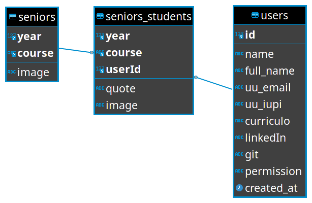

# Seniors

> Last change by Gonçalo Matos at 31/08/2021

Seniors section presents the students that have finished any course under NEI jurisdiction.

## Database

To add a new course, or a new year to a course, add an entry with the *year* and *course* information to `seniors` table. If there is an image for that class, it can be defined in *image* attribute (not shown if null).

Then, for each year/course entry on this table, there must be multiple students at `seniors_students` table. The *userId* attribute is mandatory and consists of the user id at the `users` table. The *quote* and *image* columns are optional and only shown if not null.

## Routing

This page is available at multiple locations, one for each course. The url matches `/seniors/:id`, being `:id` the course id. 

The ids are available at the API `/seniors/courses` endpoint. However, to avoid unecessary calls to the API every time the menu is rendered, these ids are hard coded in its definition file at [`Components/Navbar/data.js`](../src/Components/Navbar/data.js).

## View

The component that renders this page is [`Pages/Seniors/index.js`](../src/Pages/Seniors/index.js). It starts by validating the course ID at the `/seniors/courses` endpoint. If it is valid, it gets the years that have students for that course, at the API `/seniors/courses/years?course=:id` endpoint, being `:id` the course ID.

Gotten the years, it is time to render one tab for each, with the most recent year selected by default.

Once a tab is selected, the list of students for that year is obtained through `/seniors?course=:id&year=:year` endpoint, being `:id` the course id and `:year` the year of the tab selected. The course image and each student's image and quote are rendered conditionally (only if not null).