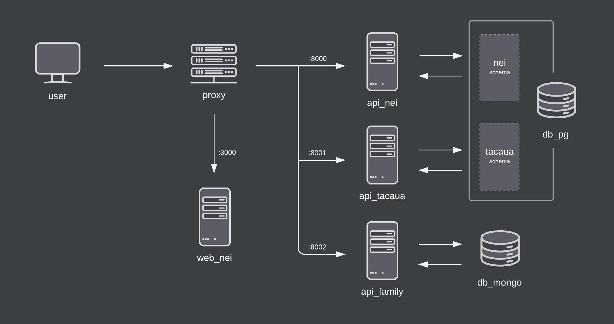
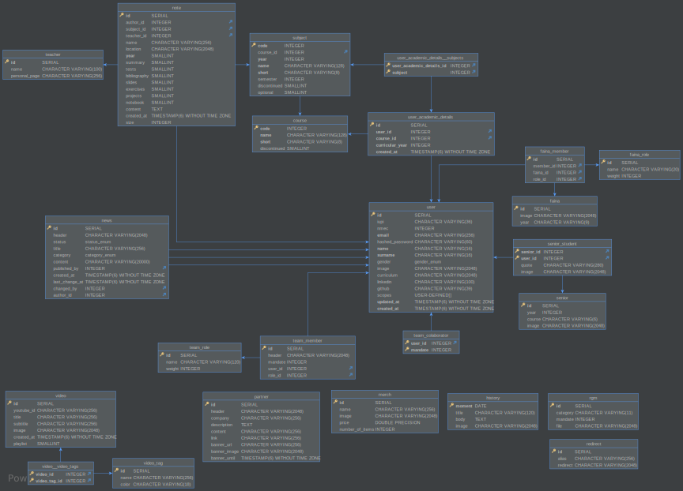
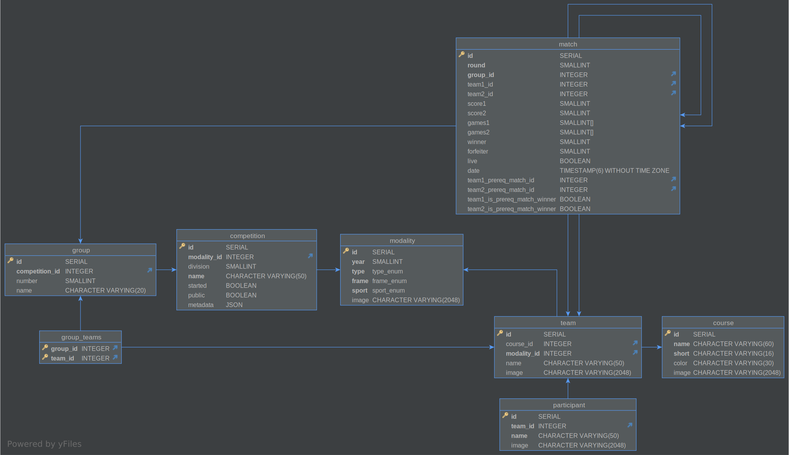

# Architecture

## System Architecture

<!-- TODO: complete -->

One of the primary advantages of microservices is that teams can work independently, with their tools and in a different language from other teams. So, code reuse might not be possible.

Schema-per-service – each service has a database schema that’s private to that service

## Database UMLs

### NEI Service

### Taça UA Service

### Family Service

